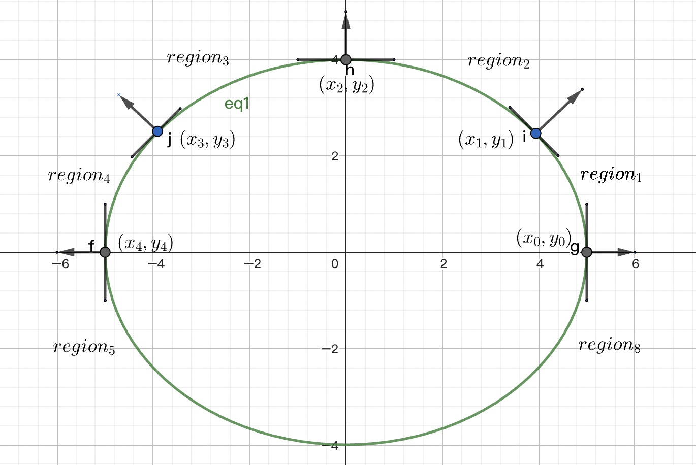
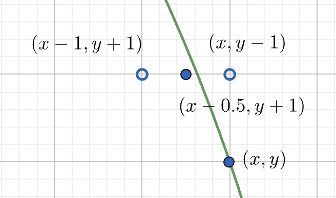

## 椭圆方程

椭圆方程的基本形式：$f(x, y) = Ax^2 + Bxy + Cy^2 + Ex + Fy + D = 0$
简单起见，此处我们假设中心 $(x_c, y_c)$ 位于原点 $(0, 0)$，则方程为：
$$
\begin{align*}
f(x, y) = Ax^2 + Bxy + Cy^2 + D = 0
\end{align*}
$$
记一焦点坐标为 $(x_f, y_f)$，长轴为 $a$，短轴为 $b$，焦距为 $c$，椭圆逆时针旋转角度为 $\theta$ ，则有：
$$
\begin{align*}
\begin{cases}
c = \sqrt{a^2 - b^2}\\
x_f = c\cos\theta\\
y_f = c\sin\theta
\end{cases}
\qquad\qquad
\begin{cases}
A = a^2 - x_f^2\\
B = -2x_fy_f\\
C = a^2 - y_f^2\\
D = a^2(x_f^2 + y_f^2 - a^2)
\end{cases}
\end{align*}
$$

## 区域划分

椭圆关于其长轴对称，故只需绘制其中一部分，另一部分由对称关系可得。此处不妨选择：
$$
\begin{align*}\begin{cases}
Ax^2 + Bxy + Cy^2 + D = 0\\
\cos{\theta}\cdot y - sin{\theta}\cdot x > 0
\end{cases}\end{align*}
$$
本程序采用 Bresenham 算法，依据椭圆上每一点处的斜率 $k$ 将我们选择的半个椭圆分为四个区域：$k_0 \in (-\infty, 1]$，$k_1 \in (-1, 0]$，$k_2 \in (0, 1]$，$k_3 \in [1,\infty)$。

椭圆上每一点处法向量 $\vec{n}$ 垂直于切线，故可转化为求法线方向。
区域 8 - 1 分界：$\vec{n_0} = (1, 0)$；区域 1 - 2 分界：$\vec{n_1} = (\frac{\sqrt{2}}{2}, \frac{\sqrt{2}}{2})$；区域 2 - 3 分界：$\vec{n_2} = (0, 1)$；区域 3 - 4 分界：$\vec{n_3} = (-\frac{\sqrt{2}}{2}, \frac{\sqrt{2}}{2})$；区域 4 - 5 分界：$\vec{n_4} = (-1, 0)$。
法向量可由梯度求得：$\vec{n} = \frac{\vec{grad}(f(x, y))}{||\vec{grad}(f(x, y))||} = \frac{(2Ax + By, Bx + 2Cy)}{||(2Ax + By, Bx + 2Cy)||}$。实际在判断时，只要判断 $\vec{grad}{f(x, y)} = (2Ax + By, Bx + 2Cy)$ 两个分量的正负以及大小关系就够了。

在实际运算时，为了避免每次都要将点代入计算，我们可以算出分界点的坐标，之后每次循环只要判断是否达到分界点就好了。
$$
\begin{align*}
\begin{cases}
Bx + 2Cy = 0\\
Ax^2 + Bxy + Cy^2 + D = 1\\
x > 0
\end{cases}
\Rightarrow 
\begin{cases}
k_0 = -\frac{B}{2C}\\
x_0 = \sqrt{\frac{-D}{A + Bk_1 + Ck_1^2}}\\
y_0 = k_0x_0
\end{cases}
\end{align*}
$$

$$
\begin{align*}
\begin{cases}
2Ax + By = Bx + 2Cy\\
Ax^2 + Bxy + Cy^2 + D = 1\\
\end{cases}
\Rightarrow 
\begin{cases}
k_1 = -\frac{2A-B}{2C-B}\\
x_1 = \pm\sqrt{\frac{-D}{A + Bk_1 + Ck_1^2}}\\
y_1 = k_2x_2
\end{cases}
\end{align*}
$$

$$
\begin{align*}
\begin{cases}
2Ax + By = 0\\
Ax^2 + Bxy + Cy^2 + D = 1\\
\end{cases}
\Rightarrow 
\begin{cases}
k_2 = -\frac{B}{2A}\\
y_2 = \sqrt{\frac{-D}{Ak_3^2 + Bk_3 + C}}\\
x_2 = k_3y_3
\end{cases}
\end{align*}
$$

$$
\begin{align*}
\begin{cases}
2Ax + By = -(Bx + 2Cy)\\
Ax^2 + Bxy + Cy^2 + D = 1\\
\end{cases}
\Rightarrow 
\begin{cases}
k_3 = -\frac{2A+B}{2C+B}\\
x_3 = \sqrt{\frac{-D}{A + Bk_4 + Ck_4^2}}\\
y_3 = k_4x_4
\end{cases}
\end{align*}
$$

由于分界点按逆时针顺序排列，我们每次判断 $(x_1, y_1) \times (x_i, y_i) = x_1y_i - x_iy_1$ 的正负，若为负则取 $(x_i, y_i)$ 关于原点的对称点作为分界点。

## Bresenham 算法

以区域 1 为例。

当前所在点 $(x, y)$，下一个点选择为 $(x-1, y+1)$ 或 $(x, y+1)$。根据其中点 $(x-0.5, y+1)$ 位置进行选择。若中点在椭圆内部，即 $f(x-0.5, y+1) < 0$，则下一个点为 $(x, y+1)$，否则选择 $(x-1, y+1)$。

记 $p^{(1)} = f(x-0.5, y+1) = A(x-0.5)^2 + B(x-0.5)(y+1) + C(y+1)^2$，则每次只需要判断 $p$ 的正负。下构造递推关系简化运算：
$$
\begin{align*}
&\begin{cases}
\Delta{p_n}^{(1)}(x, y) \triangleq p^{(1)}(x, y+1) - p^{(1)}(x, y) = Bx + 2Cy + C\\
\Delta{p_{nw}}^{(1)}(x, y) \triangleq p^{(1)}(x-1, y+1) - p^{(1)}(x, y) = \Delta{p_n}^{(1)} - 2Ax -By +A-B
\end{cases}
\\ 
\\
&\begin{cases}
\Delta{p_{n\_n}} \triangleq \Delta p_n^{(1)}(x, y+1) - \Delta{p_n}^{(1)}(x, y) = 2C\\
\Delta{p_{n\_nw}} = \Delta{p_n^{(1)}(x-1, y+1)} - \Delta{p_n}^{(1)}(x, y) = 2C - B\\
\Delta{p_{nw\_n}} \triangleq \Delta{p_{nw}}^{(1)}(x, y+1) - \Delta{p_{nw}}^{(1)}(x, y) = 2C - B\\
\Delta{p_{nw\_nw}} \triangleq\Delta{p_{nw}}^{(1)}(x-1, y+1) - \Delta{p_{nw}}^{(1)}(x, y) = 2(A-B+C)
\end{cases}
\\ 
\\
&(p_{i+1}^{(1)},\ \Delta{p_n}^{(1)},\ \Delta{p_{nw}}^{(1)}) =
\begin{cases}
(p_i^{(1)} + \Delta{p_n}^{(1)},\ \Delta{p_n}^{(1)} + \Delta{p_{n\_n}, \Delta{p_{nw}}^{(1)} + \Delta{p_{nw\_n}}})  &p_i^{(1)} < 0\\
(p_i^{(1)} + \Delta{p_{nw}}^{(1)},\ \Delta{p_n}^{(1)} + \Delta{p_{n\_nw}, \Delta{p_{nw}}^{(1)} + \Delta{p_{nw\_nw}}}) &p_i \ge 0
\end{cases}

\end{align*}
$$
边界条件：$y < y_1$，当 $ =y_1$ 时进入区域 2。注意原先我们有 $p^{(1)}(x, y) = f(x-0.5, y+1)$，进入区域 2 后，应变为 $p^{(2)}(x, y) = f(x - 1, y + 0.5)$，易知 $p^{(2)}(x, y) = p^{(1)}(x - 0.5, y - 0.5)$。同理有 $\Delta p_{nw}^{(2)}(x, y) = \Delta p_{nw}(x - 0.5, y - 0.5)$，$\Delta{p_w}^{(1)} \triangleq p(x-1, y) - p(x, y)$，$\Delta{p_w}^{(2)} = \Delta{p_w}(x - 0.5, y - 0.5)$。
可求得：
$$
\begin{align*}
&\begin{cases}
\Delta{p_{w}}^{(2)}(x, y) = -2Ax -By + 2A + \frac{1}{2}B = \Delta p_{nw}^{(1)} - \Delta p_n^{(1)} + A + \frac{3}{2}B\\
\Delta{p_{nw}}^{(2)}(x, y) = \Delta{p_{nw}}^{(1)} + A - C
\end{cases}\\
\\
&\begin{cases}
\Delta p_{w\_w} \triangleq \Delta{p_{w}}^{(2)}(x-1, y) - \Delta{p_w}^{(2)}(x, y) = 2A\\
\Delta p_{w\_nw} \triangleq \Delta{p_w}^{(2)}(x-1, y+1) - \Delta{p_w}^{(2)}(x, y) = 2A-B\\
\Delta p_{nw\_w} \triangleq \Delta{p_{nw}}^{(2)}(x-1, y) - \Delta{p_{mw}}^{(2)}(x, y) = 2A-B\\
\Delta p_{nw\_nw} = 2(A-B+C)
\end{cases}\\
\\
&(p_{i+1}^{(2)}, \Delta p_{w}^{(2)}, \Delta{p_{nw}}^{(2)}) = 
\begin{cases}
(p_{i}^{(2)} + \Delta p_{nw}, \Delta p_{w}^{(2)} + \Delta{p_{w\_nw}}, \Delta{p_{nw}}^{(2)} + \Delta{p_{nw\_nw}}) &p_i^{(2)} < 0\\
(p_{i}^{(2)} + \Delta p_{w}, \Delta p_{w}^{(2)} + \Delta{p_{w\_ww}}, \Delta{p_{nw}}^{(2)} + \Delta{p_{nw\_w}}) &p_i^{(2)} \ge 0
\end{cases}
\end{align*}
$$
边界条件：$x > x_2$。区域 3:
$$
\begin{align*}
&\begin{cases}
\Delta{p_w}^{(3)}(x, y) = \Delta{p_w}^{(2)}(x, y-1) = \Delta{p_w}^{(2)} + B\\
\Delta{p_{sw}}^{(3)}(x, y) = p^{(1)}((x-0.5)-1, (y-1.5)-1) - p^{(1)}(x-0.5, y-1.5) = 2\Delta{p_w}^{(2)} - \Delta{p_{nw}}^{(2)} + 4C - B
\end{cases}\\
\\
&\begin{cases}
\Delta{p_{w\_w}} = 2A\\
\Delta{p_{w\_sw}} = 2A + B\\
\Delta{p_{sw\_w}} = 2A + B\\
\Delta{p_{sw\_sw}} = 2(A+B+C)
\end{cases}\\
\\
&(p^{(3)}_{i+1}, \Delta{p_w}^{(3)}, \Delta{p_{sw}}^{(3)}) = 
\begin{cases}
(p^{(3)}_{i} + \Delta{p_w}^{(3)}, \Delta{p_w}^{(3)} + \Delta{p_{w\_w}}, \Delta{p_{sw}}^{(3)} + \Delta{p_{sw\_w}}) & p_i < 0\\
(p^{(3)}_{i} + \Delta{p_{sw}}^{(3)}, \Delta{p_w}^{(3)} + \Delta{p_{w\_sw}}, \Delta{p_{sw}}^{(3)} + \Delta{p_{sw\_sw}}) & p_i \ge 0
\end{cases}
\end{align*}
$$
边界条件：$x > x_3$。区域 4:
$$
\begin{align*}
&\begin{cases}
\Delta{p_{sw}}^{(4)} = \Delta{p_{sw}}^{(3)} + C - A\\
\Delta{p_s}^{(4)} = \Delta{p_{sw}}^{(3)} - \Delta{p_w}^{(3)} - B
\end{cases}\\
\\
&\begin{cases}
\Delta p_{sw\_s} = 2C+B\\
\Delta p_{sw\_sw} = 2(A+B+C)\\
\Delta p_{s\_s} = 2C\\
\Delta p_{s\_sw} = 2C + B
\end{cases}\\
\\
&(p_{i+1}^{(4)}, \Delta p_{sw}^{(4)}, \Delta{p_s}^{(4)}) = 
\begin{cases}
(p_{i+1}^{(4)} + \Delta{p_{sw}}^{(4)}, \Delta p_{sw}^{(4)} + \Delta{p_{sw\_sw}}, \Delta{p_s}^{(4)} + \Delta{p_{s\_sw}}) &p_i^{(4)} < 0\\
(p_{i+1}^{(4)} + \Delta{p_{w}}^{(4)}, \Delta p_{sw}^{(4)} + \Delta{p_{sw\_w}}, \Delta{p_s}^{(4)} + \Delta{p_{s\_w}}) &p_i^{(4)} \ge 0
\end{cases}
\end{align*}
$$

## Clipping

本实验中，直接通过判断是否超出边界来进行裁剪。若在当前区域和当前区域的对称部分都超出边界，则直接跳到下一区域，否则继续计算。在绘制时，若坐标超出边界则不进行绘制。

