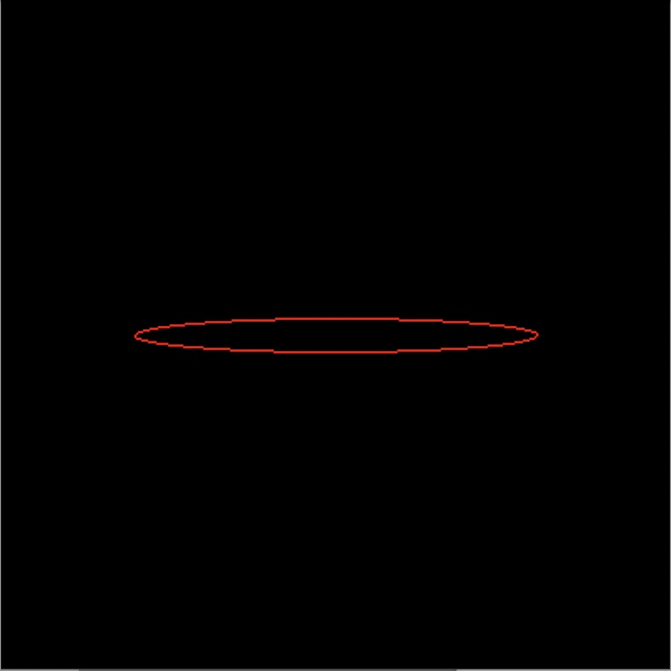
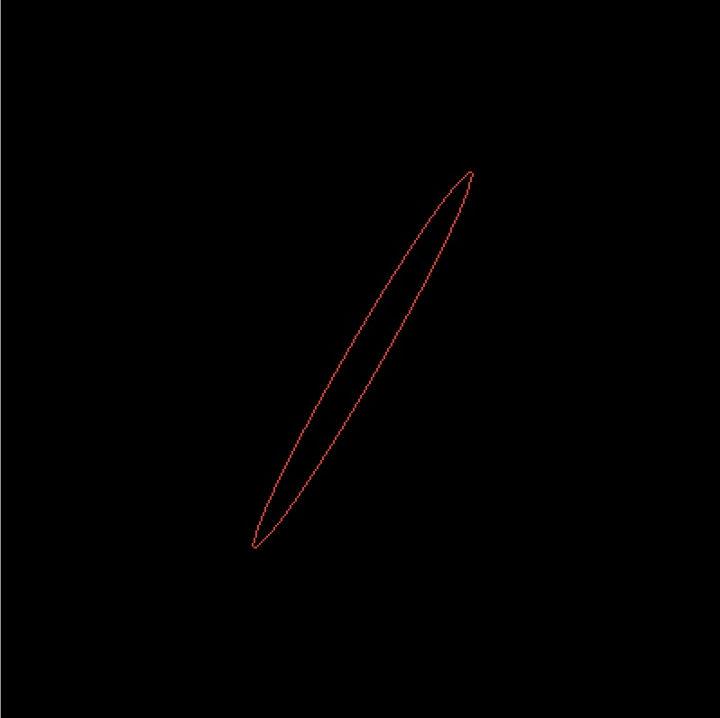
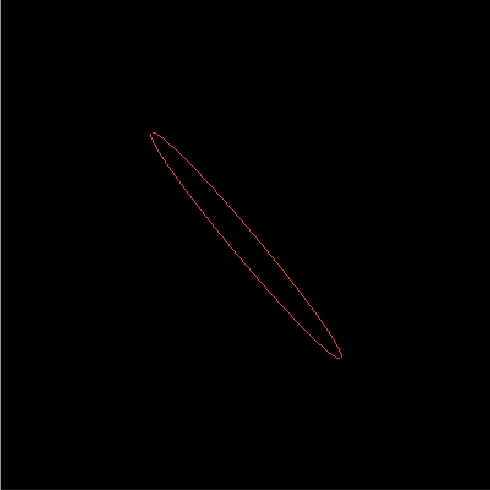
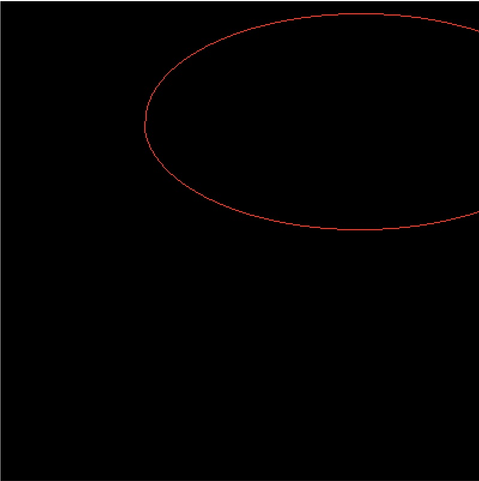
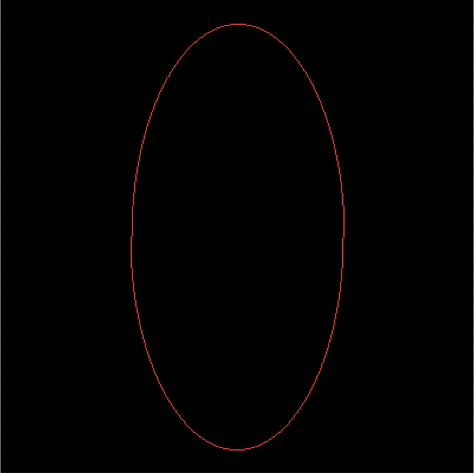

## 实验步骤与分析

### main

从输入读入椭圆中心 $(x, y)$，长轴 $Ra$，短轴 $Rb$，以及旋转角度 $\theta$（正方向为逆时针方向）。

此处读入的坐标以窗口中心为原点，如 $(0, 0)$ 表示椭圆会出现在视窗的正中心。但在进行计算时，为方便起见像素坐标以左下角为原点，故进行坐标转换。

此处设置窗口大小为 400 * 400

```c++
int main() 
{
	int x, y, ra, rb;
	double theta; 	
	// Get ra, rb, x, y, and theta from input
  // ......

	// the input (x, y) takes the center of the window as origin
	// transform it to the viewport coordinate
	// [-WIDTH/2, WIDTH/2 - 1] * [-HEIGHT/2, HEIGHT/2 - 1] -> [0, WIDTH - 1] * [0, HEIGHT - 1]
	x += WIDTH / 2;
	y += HEIGHT / 2;

	// output buffer
	unsigned char data[HEIGHT*WIDTH*3];
	memset(data, 0, WIDTH * HEIGHT * 3);
	// draw the ellipse
	ellipse(x, y, ra, rb, theta, data);
	// output
	ppmWrite("result.ppm", data, WIDTH, HEIGHT);
	return 0;
}
```

### ellipse

首先判断输入 $Ra$ 是否大于等于 $Rb$。若发现 $Ra < Rb$，本程序不报错，选择绘制旋转 $90$ 度的椭圆，以 $Rb$ 为长轴，以 $Ra$ 为短轴。

接着根据实验原理中列出的公式，计算各参数，并依次进行绘制。

```c++
// if a < b, set b to be the major axis
	if(a < b)	
	{
		std::swap(a, b);
		theta -= PI / 2;
	}
	// focal length
	double c = sqrt(a * a - b * b);
	// focus (xf, yf)
	double xf = c * cos(theta);
	double yf = c * sin(theta);

	// general formula of ellipse (suppose the center is at (0, 0))
	// Ax^2 + Bxy + Cy^2 + D = 0
	double A = a * a - xf * xf;
	double B = -2 * xf * yf;
	double C = a * a - yf * yf;
	double D = a * a * (yf * yf - A);

	// boundary point of area_8 and area_0
	double k1 = - B / (2 * C);
	double x1 = sqrt(-D / (A + B * k1 + C * k1 * k1));
	double y1 = k1 * x1;
	x1 = round(x1);	y1 = round(y1);

	// boundary point of area_0 and area_1
	double k2 = (2 * A - B) / (2 * C - B);
	double x2 = sqrt(- D / (A + B * k2 + C * k2 * k2));
	double y2 = k2 * x2;
	if(x1 * y2 - x2 * y1 < 0)
	{
		y2 = -y2;	x2 = -x2;
	}
	x2 = round(x2); y2 = round(y2);

	// boundary point of area_1 and area_2
	double k3 = -B / (2 * A);
	double y3 = sqrt(-D / (A * k3 * k3 + B * k3 + C));
	double x3 = k3 * y3;
	if(x1 * y3 - x3 * y1 < 0)	
	{
		x3 = -x3;	y3 = -y3;
	}
	x3 = round(x3);	y3 = round(y3);

	// boundary point of area_2 and area_3
	double k4 = -(2 * A + B) / (2 * C + B);
	double x4 = -sqrt(-D / (A + B * k4 + C * k4 * k4));
	double y4 = k4 * x4;
	if(x1 * y4 - x4 * y1 < 0)	
	{
		y4 = -y4;	x4 = -x4;
	}
	x4 = round(x4);	y4 = round(y4);

	// begin point
	int x_pos = x1, y_pos = y1;
	int x_mid = x_pos - 0.5, y_mid = y_pos + 1;

	double dpn = B * x_mid + 2 * C * y_mid + C;
	double dpnw = dpn - 2 * A * x_mid - B * y_mid + A - B;
	double dpn_n = 2 * C;
	double dpn_nw = 2 * C - B;
	double dpnw_n = dpn_nw;
	double dpnw_nw = 2 * (A - B + C);

	// region 0
	double p = A * x_mid * x_mid + B * x_mid * y_mid + C * y_mid * y_mid + D;
	while(y_pos < y2)
	{
		draw(x_pos, y_pos, xc, yc, data);
		y_pos++;
		if(p < 0)
		{
			p += dpn;
			dpn += dpn_n;	dpnw += dpnw_n;
		}
		else
		{
			x_pos -= 1;
			p += dpnw;
			dpn += dpn_nw;	dpnw += dpnw_nw;
		}
	}
// ......
```

在绘制图像时，同时绘制关于椭圆长轴对称的两个点。由于图像是正立输出的，还要再进行一次坐标转换，将纵坐标进行倒置。

```c++
void draw(int x, int y, int xc, int yc, unsigned char* data)
{
	if(!isOutofWindow(x, y, xc, yc))
		data[(HEIGHT - (y + yc)) * WIDTH * 3 + (x + xc) * 3] = 255;
	if(!isOutofWindow(-x, -y, xc, yc))
		data[(HEIGHT - (-y + yc)) * WIDTH * 3 + (-x + xc) * 3] = 255;
}
```

### 坐标范围判断

判断 $(x + x_c, y + y_c)$ 是否属于 $[0, WIDTH - 1] \times [0, HEIGHT - 1]$ 即可

```c++
bool isOutofWindow(int x, int y, int xc, int yc)
{
	return (y + yc < 0) || (y + yc >= HEIGHT) || (x + xc < 0) || (x + xc >= WIDTH);
}
```

## 实验环境及运行方法

编程语言：c++

c++ 版本：c++11

编译及运行：

```shell
g++ -std=c++11 ellipse.cpp
./a.out
```

根据提示输入对应参数：

```shell
please input the semi-major axis a: [your input]
please input the semi-minor axis b: [your input]
please input the center
x: [your input]
y: [your input]
please input the rotation angle: [your input]
```

## 实验结果展示

$Ra = 120, Rb = 10, (x, y) = (0, 0), \theta = 0\degree$




$Ra = 120, Rb = 10, (x, y) = (0, 0), \theta = 60\degree$




$Ra = 120, Rb = 10, (x, y) = (0, 0), \theta = 490\degree(=130\degree)$




$Ra = 180, Rb = 90, (x, y) = (100, 100), \theta = 0\degree$




$Ra = 90, Rb = 180, (x, y) = (0, 0), \theta = 0\degree$ 


